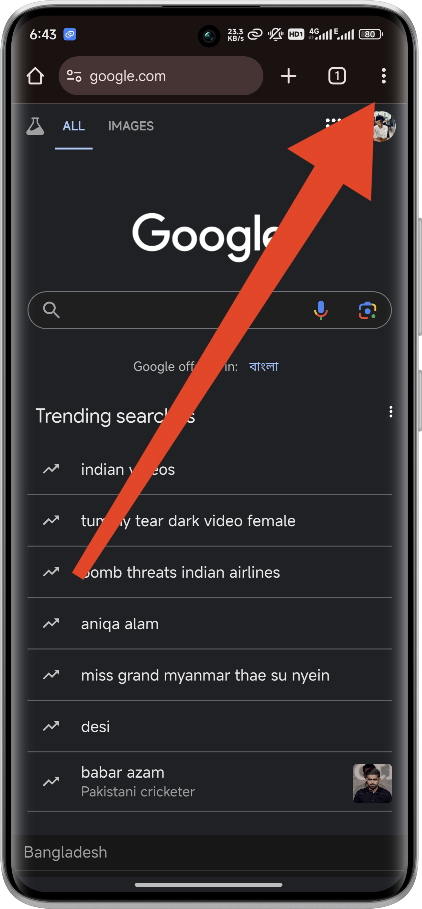
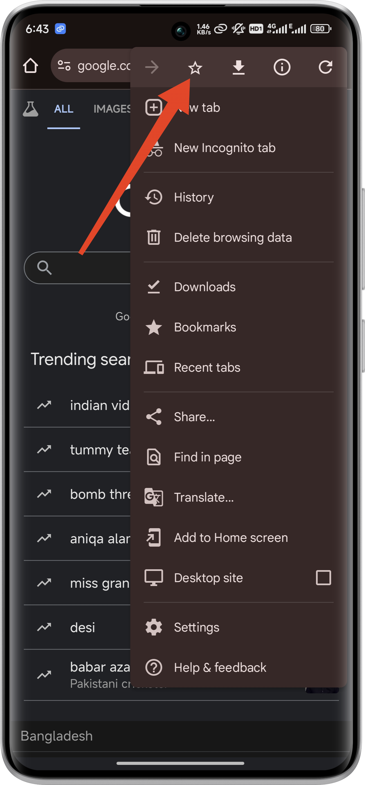
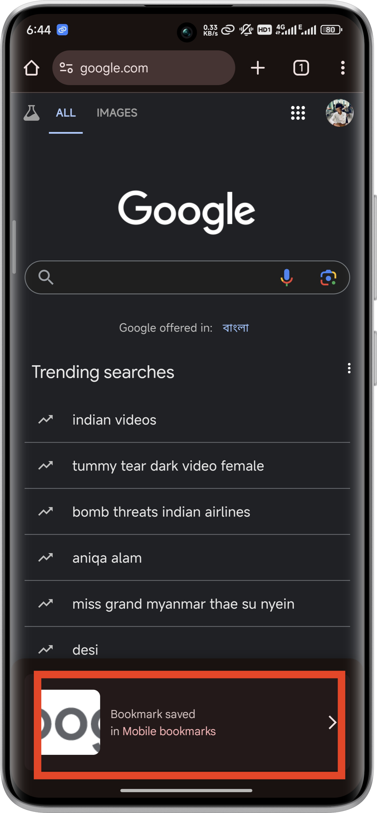
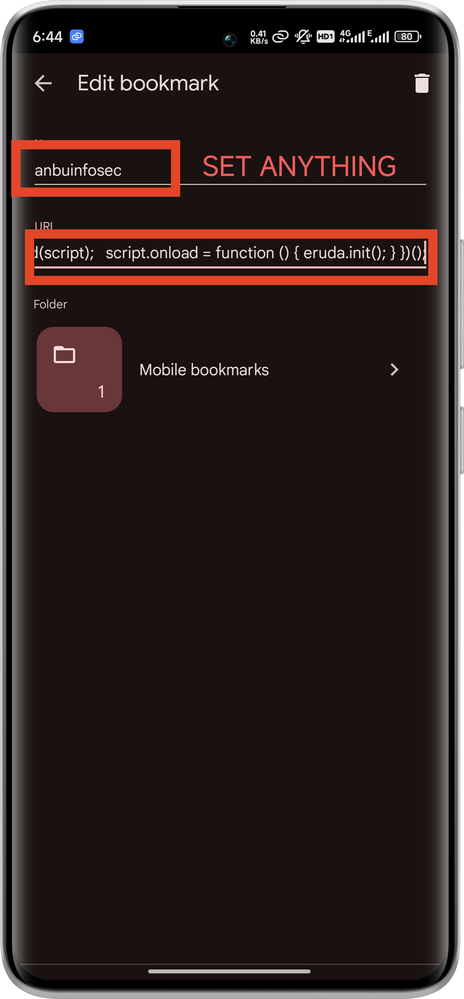
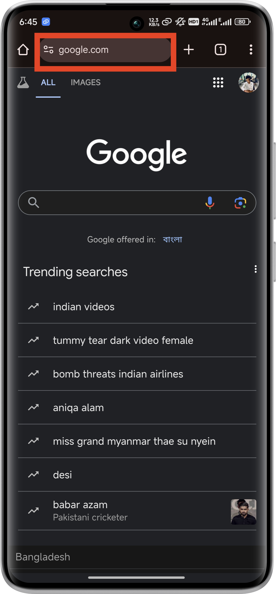
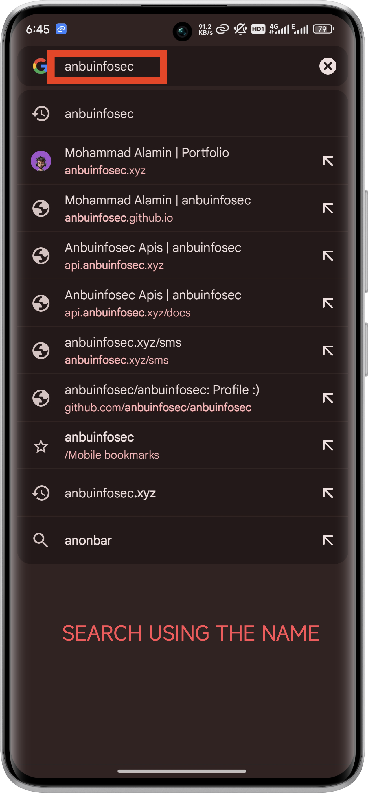
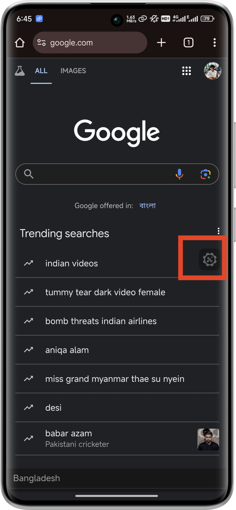
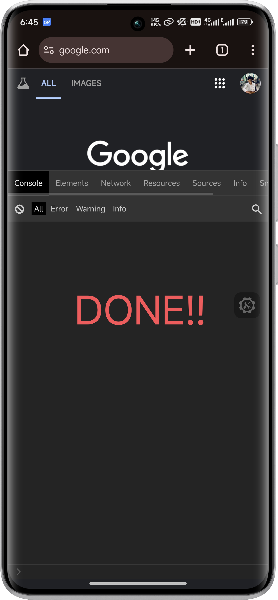

# inspect-andriod
Open Inspect Elements on Mobile Phone Browsers.

## Step 1: Create a New Bookmark
1. Open your mobile browser (e.g., Chrome, Safari).
2. Create a new bookmark. You can do this by visiting any web page and adding it to your bookmarks.

## Step 2: Edit the Bookmark’s URL
1. Open the bookmarks manager in your browser.
2. Find the newly created bookmark and edit it.
3. Replace the bookmark’s URL with the following JavaScript code.
4. Save the changes.

```javascript
javascript:(function() {
  var script = document.createElement('script');
  script.src = 'https://cdnjs.cloudflare.com/ajax/libs/eruda/2.4.1/eruda.min.js';
  document.body.appendChild(script);
  script.onload = function () { eruda.init(); }
})();
```

## Step 3: Use the Bookmarklet
1. Navigate to the web page you want to inspect.
2. Open your bookmarks and tap the “Inspect Element” bookmark.
3. The Eruda console will appear at the bottom of the screen, allowing you to inspect elements, view console logs, and more.


## Step Images

|  |  |
|---------------------------------|---------------------------------|
|  |  |
|  |  |
|  |  |


## Tutorial

[]()

## 🌐 Socials:
[](https://facebook.com/anbuinfosec) [](https://instagram.com/anbuinfosec) [](https://linkedin.com/in/anbuinfosec) [](https://youtube.com/@anbuinfosec) [](https://codepen.io/anbuinfosec) 